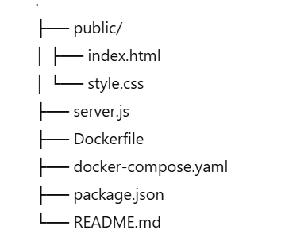

# 📦 Dockerized Node.js + MongoDB User Signup App

This project is a simple web application that allows users to sign up using their email, username, and password. It is built with:

-  Node.js (Express.js)
-  MongoDB
-  Docker + Docker Compose
-  AMAZONE EC2
-  Mongo Express

---

## 🚀 Features

- User-friendly signup form
- REST API to add users
- MongoDB for persistent storage
- Mongo Express for easy DB inspection
- Dockerized for easy deployment
- Full deployment guide on AWS EC2
- Learning about Docker and AWS EC2 instace 

---

## 📂 Project Structure




## Amazone instance commands used 
```bash 
sudo apt update
sudo apt install -y docker.io docker-compose
sudo systemctl start docker
sudo systemctl enable docker


## link of aws host
http://56.228.22.107:5050/